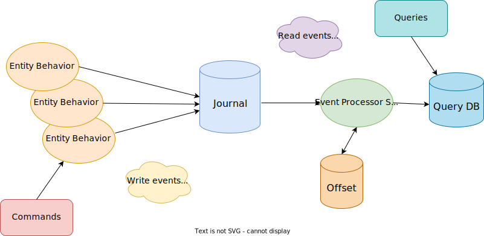
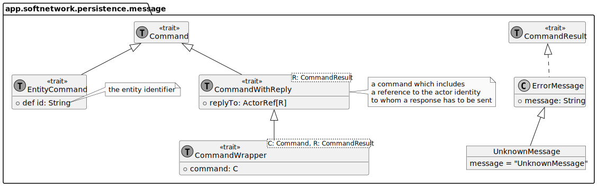

# generic-persistence-api
a CQRS/ES framework in scala using akka persistence



"CQRS is simply the creation of two objects where there was previously only one. The separation occurs based upon whether the methods are a command or a query (the same definition that is used by Meyer in Command and Query Separation: a command is any method that mutates state and a query is any method that returns a value)."
—Greg Young, CQRS, Task Based UIs, Event Sourcing agh!

## Write Side

**generic-persistence-api** relies on [Akka Persistence](https://doc.akka.io/docs/akka/current/typed/persistence.html) to provide a **scalable** and **resilient** way to implement the write-side of CQRS using commands and events that simplify the implementation of event-sourced systems.

### Cluster Sharding

Cluster sharding is a distributed system mechanism in Akka that allows stateful actors to be distributed across a cluster of nodes, while ensuring that messages are routed to the correct actor instance regardless of which node it is running on, providing a powerful mechanism for scaling out stateful actors.

Here's an overview of how cluster sharding works :

1. **Actor entity**: Each stateful actor that needs to be distributed using cluster sharding is referred to as an "actor entity".
2. **Sharding region**: A "sharding region" (node) is responsible for managing a set of actor entities. Each sharding region is responsible for a subset of the actor entities in the system.
3. **Shard identifier**: Each actor entity is assigned a unique "shard identifier" that is used to determine which sharding region is responsible for managing that entity.
4. **Message routing**: When a message is sent to an actor entity, the message is first sent to the sharding region responsible for managing that entity. The sharding region then routes the message to the appropriate actor instance based on the entity identifier that identifies a specific entity within that shard.
5. **Node awareness**: The sharding mechanism is aware of the state of the cluster, so it can ensure that actor instances are running on nodes that are currently available and healthy.
6. **Persistence**: Akka Persistence is used to persist the state of each actor entity, ensuring that the state is durable and can survive node failures and other types of system failures.

By default, the shard identifier is the absolute value of the hashCode of the entity identifier modulo the total number of shards. The number of shards is configured by `akka.cluster.sharding.number-of-shards`. Its value must be the same for all nodes in the cluster.

The default implementation _LeastShardAllocationStrategy_ allocates new shards to the sharding region (node) with the least number of previously allocated shards.

One of the key benefits of the Cluster Sharding is that it allows the system to scale horizontally by distributing the workload across multiple nodes. The sharding mechanism ensures that the entities are evenly distributed across the nodes, which prevents any single node from becoming a bottleneck.

Another benefit is that it provides fault tolerance and resilience to the system. If a node fails, the shards that were managed by that node are automatically moved to other nodes in the cluster. This ensures that the system can continue to function even in the presence of node failures.

### Entity Behavior

In Akka, an "EventSourceBehavior" is an entity actor designed to work with Akka Persistence to ensure that its state changes are durable and can be recovered in the event of failures or restarts.

The write-side using Akka **EventSourcedBehavior** typically involves the following steps:

1. **Command handling**: When a **command** is received, it is typically handled by an instance of the EventSourcedBehavior actor that represents the actor entity. The actor uses the current **state** of the entity to determine how to handle the command, and may generate one or more **events** before eventually responding to the sender.
2. **Event persistence**: Once the events have been generated, they are appended to a **journal** (an event log using Akka Persistence's event sourcing mechanism) along with optional **tags**. It allows events to be easily filtered and queried based on their tags, improving the efficiency of read-side **projections**.
3. **Event replay**: When the actor is created or restarted, Akka Persistence automatically replays all the events from the event log, allowing the actor to rebuild its current state based on the events.
4. **Snapshotting**: To avoid replaying all events every time the actor is created or restarted, Akka EventSourcedBehavior supports snapshotting. Every N events or when a given predicate of the state is fulfilled, the actor can save a **snapshot** of its current state, including any accumulated events and their tags after the previous snapshot. This snapshot is persisted alongside the event log and can be used to restore the state of the actor at a later point in time, rather than replaying all events from the beginning.

"Entity Behavior" is a **specialized factory** that relies on Cluster Sharding to create instances of "EventSourceBehavior" actors, each of which corresponds to a single actor entity managed by a sharding region. 

It must define the type of command and event classes that the behavior will handle along with the state class that will handle its in-memory state.

```scala
trait EntityBehavior[C <: Command, S <: State, E <: Event, R <: CommandResult]
```

A `persistenceId` attribute must be defined in order to define the Entity Type Key of the underlying entity actors that uniquely identifies the type of entity in the cluster.

````scala
  final def TypeKey(implicit c: ClassTag[C]): EntityTypeKey[C] = EntityTypeKey[C](s"$persistenceId-$environment")

  /** @return
    *   the key used to define the Entity Type Key of this actor
    */
  def persistenceId: String
````

It defines several parameters that may be overriding.

```scala
  /** @return
    *   number of events before saving a snapshot of the current actor entity state. If multiple
    *   events are persisted with a single Effect the snapshot will happen after all of the events
    *   are persisted rather than precisely every `snapshotInterval`
    */
  def snapshotInterval: Int = 10

  /** @return
    *   number of snapshots to keep
    */
  def numberOfSnapshots: Int = 2

  /** @return
    *   node role required to start the entity actor
    */
  def role: String = ""

```

The behavior of the entity actor is determined by a set of command and event handlers, which are defined by the user.

```scala

    /** @param entityId
      *   - entity identity
      * @param state
      *   - current state
      * @param command
      *   - command to handle
      * @param replyTo
      *   - optional actor to reply to
      * @param timers
      *   - scheduled messages associated with this entity behavior
      * @return
      *   effect
      */
    def handleCommand(
      entityId: String,
      state: Option[S],
      command: C,
      replyTo: Option[ActorRef[R]],
      timers: TimerScheduler[C]
    )(implicit context: ActorContext[C]): Effect[E, Option[S]] =
      command match {
        case _ => Effect.unhandled
      }

    /** This method is invoked whenever an event has been persisted successfully or when the entity is
      * started up to recover its state from the stored events
      *
      * @param state
      *   - current state
      * @param event
      *   - event to hanlde
      * @return
      *   new in-memory state after applying the event to the previous state
      */
    def handleEvent(state: Option[S], event: E)(implicit context: ActorContext[_]): Option[S] =
      event match {
        case _ => state
      }

    /** associate a set of tags to an event before the latter will be appended to the event log
    *
    * This allows events to be easily filtered and queried based on their tags, improving the
    * efficiency of read-side projections
    *
    * @param entityId
    *   - entity id
    * @param event
    *   - the event to tag
    * @return
    *   set of tags to associate to this event
    */
  protected def tagEvent(entityId: String, event: E): Set[String] = Set.empty

  /** This method is called just after the state of the corresponding entity has been successfully
    * recovered
    *
    * @param state
    *   - current state
    * @param context
    *   - actor context
    */
  def postRecoveryCompleted(state: Option[S])(implicit context: ActorContext[C]): Unit = {}
```

During its initialization, the factory uses Cluster Sharding to create a sharding region for the actor entities which will be responsible for managing the lifecycle of the entities, including creating new entities, stopping entities, and routing commands to the appropriate entity.

````scala
  def init(system: ActorSystem[_], maybeRole: Option[String] = None)(implicit
    c: ClassTag[C]
  ): ActorRef[ShardingEnvelope[C]] = {
    ClusterSharding(system) init Entity(TypeKey) { entityContext =>
      this(
        entityContext.entityId,
        PersistenceId(entityContext.entityTypeKey.name, entityContext.entityId)
      )
    }.withRole(maybeRole.getOrElse(role))
  }
````

The framework handles the complexities of event persistence, replay, and snapshotting, allowing developers to focus on defining the behavior of the domain entity in response to commands.

The resulting system is highly efficient, with the ability to quickly rebuild its state from a **snapshot** and replay only a subset of events, while still ensuring the accuracy of the system's state.

Moreover, providing the ability to **tag events** enables **read-side projections** to be easily implemented and maintained, improving the overall performance and scalability of the system.


### Entity Pattern

The framework defines the "Entity Pattern" to allow a sender to communicate easily with the actor entities within the distributed system.

To send a command to an actor entity, a reference to the latter is required. This reference can be obtained by passing to the cluster sharding the key used to define the **entity type key** of the entity actor along with its **entity identifier**.

Here's an overview of how the "Entity Pattern" works in the context of Cluster Sharding:

1. **Receive a command**: The sender sends to the entity pattern a command along with the entity identifier of the actor to interact with.
2. **Retrieve an EntityRef**: The Entity Pattern retrieves an entity reference corresponding to this entity identifier by passing to cluster sharding its Entity Type Key and the entity identifier.
3. **ask the entity**: The Entity Pattern calls the ask method on the Entity Reference to send the message and waits for a response.
4. **Message routing**: The message is routed to the sharding coordinator and then to the correct node where the entity actor is running based on the entity's shard identifier.
5. **Message processing**: The entity actor receives the message and processes it, potentially modifying its state and sending back a response message.
6. **Future completion**: When the response message is received, the Future representing the response message is completed with the received response message.
7. **Timeout handling**: If the response message is not received within the specified timeout, the Future will be completed with a TimeoutException.

The "Entity Pattern" must define the command classes it will handle along with the corresponding entity type key.

````scala
  trait EntityPattern[C <: Command, R <: CommandResult] extends Patterns[C, R] with Entity {
    _: CommandTypeKey[C] =>
    type Recipient = String
    //...
  }
````

It exposes several methods to allow a sender to communicate with actor entities.

````scala
  def ?(recipient: Recipient, command: C)(implicit
    tTag: ClassTag[C],
    system: ActorSystem[_]
  ): Future[R]

  def !(recipient: Recipient, command: C)(implicit
    tTag: ClassTag[C],
    system: ActorSystem[_]
  ): Unit

  def ??[T](key: T, command: C)(implicit tTag: ClassTag[C], system: ActorSystem[_]): Future[R]

  def ?(implicit tTag: ClassTag[C], system: ActorSystem[_]): Unit

````


### Commands

In CQRS, commands play a critical role in defining the write-side of the system. A command is a message that encapsulates a user's intent to perform a specific action, such as creating a new account, updating an existing record, or deleting data. The main purpose of commands is to initiate a change in the state of the system.

Command responses play also an important role in providing feedback to the user who initiated the command. When a user sends a command to the system, they expect a response that confirms that the command has been successfully executed or that an error has occurred.

The framework defines the trait **_Command_** as the root interface of any command sends to a recipient in the system, and the trait **_CommandResult_** as the root interface of any command response.



### Events

Events provide the basis for synchronizing the changes on the write-side (that result from processing commands) with the read side.

If the write-side raises an event whenever the state of the application changes, the read side should respond to that event and update the data that is used by its queries and views.

The framework defines the trait **_Event_** as the root interface of any event in the system.


### State

The state of an entity actor can be divided into two parts: the in-memory state and the persistent state.

The in-memory state represents the current state of the actor as it is being processed. This state is modified as the actor receives commands and generates events in response. The in-memory state can be any type of data structure, such as a case class or a collection.

The persistent state represents the state of the actor as it has been stored in the journal. This state includes all events that have been generated by the actor, and can be used to rebuild the in-memory state of the actor in case of a failure or restart. The persistent state is maintained by the Akka Persistence journal and is not directly accessible by the actor.

When an entity actor is created, it starts with an empty in-memory state and persistent state. As events are persisted to the journal, the persistent state is updated, and the in-memory state is rebuilt by replaying the events from the journal.

The framework defines the trait **_State_** as the root interface of the in-memory state of any entity actor.


### Serialization

Akka Persistence provides a built-in serialization mechanism that uses the Akka Serialization library. This library allows you to define serializers for your custom data types, so that they can be serialized and deserialized automatically when they are persisted to the event store.

When an Akka actor receives a command, it creates one or more domain events and sends them to the event journal for persistence. Before the events are persisted, they are serialized using the configured serialization mechanism. When events are read from the event journal, they are deserialized back into domain events using the same mechanism.

Finally, before persisting a snapshot, the current state of the actor (its in-memory state) is serialized using the configured serialization mechanism.

The framework supports natively three types of **Serializers**:
+ **proto**
+ **jackson-cbor**
+ **chill**

```hocon
akka {
  actor {
    allow-java-serialization = off

    serializers {
      proto = "akka.remote.serialization.ProtobufSerializer"
      jackson-cbor = "akka.serialization.jackson.JacksonCborSerializer"
      chill  = "com.twitter.chill.akka.AkkaSerializer"
    }
...
  }
}
```

The default [configuration](core/src/main/resources/softnetwork-persistence.conf) defines the following serialization bindings :

```hocon
akka {
  actor {
...
    enable-additional-serialization-bindings = on

    serialization-bindings {
      "app.softnetwork.persistence.model.package$Timestamped" = proto
      "app.softnetwork.persistence.message.package$ProtobufEvent" = proto # protobuf events
      "app.softnetwork.persistence.model.package$ProtobufDomainObject" = proto # protobuf domain objects
      "app.softnetwork.persistence.model.package$ProtobufStateObject" = proto # protobuf state objects

      "app.softnetwork.persistence.message.package$CborEvent" = jackson-cbor # cbor events
      "app.softnetwork.persistence.model.package$CborDomainObject" = jackson-cbor # cbor domain objects

      "app.softnetwork.persistence.message.package$Command" = chill
      "app.softnetwork.persistence.message.package$CommandResult" = chill
      "app.softnetwork.persistence.message.package$Event" = chill
      "app.softnetwork.persistence.model.package$State" = chill

    }
  }
}
```


#### Versioning

You may find it necessary to change the definition of a particular event type or aggregate at some point in the future.
You must consider how your system will be able to handle multiple versions of an event type and aggregates.

### Event Sourcing


